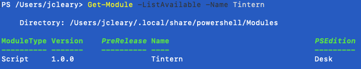
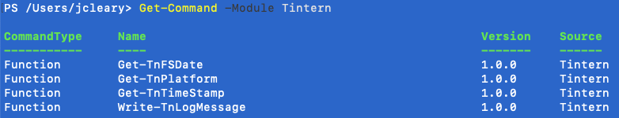

# Installing the Tintern PowerShell Library (Module)


## Install the Module

Once you've cloned the repository locally (I generally use `~/Developer` to store my repos) you can then simply add a symbolic link to your default PowerShell modules directory. e.g.

```shell
ln -s "$HOME/Developer/tin-pwsh-library" ~/.local/share/powershell/Modules/Tintern
```


## Set to Auto Load in new PowerShell Session

Simply add the following to your PowerShell Profile file using your preferred text editor!

`Import-Module Tintern`

You can find the path for the file like this when in a PowerShell session:

```powershell
PS /Users/jcleary> $PROFILE  
/Users/username/.config/powershell/Microsoft.PowerShell_profile.ps1
```

If you open a new PowerShell window it will import, but you can also force it (e.g. within a session) with:

```powershell
PS /Users/jcleary> cat $PROFILE                    
Import-Module Tintern -Force
```


## Confirm Module is Active

If you open a new PowerShell session and run `Get-Module -ListAvailable -Name Tintern` it should display as follows:.



Likewise if you run `Get-Command -Module Tintern` it should display the various commands that are available (with tab auto-complete etc.).


